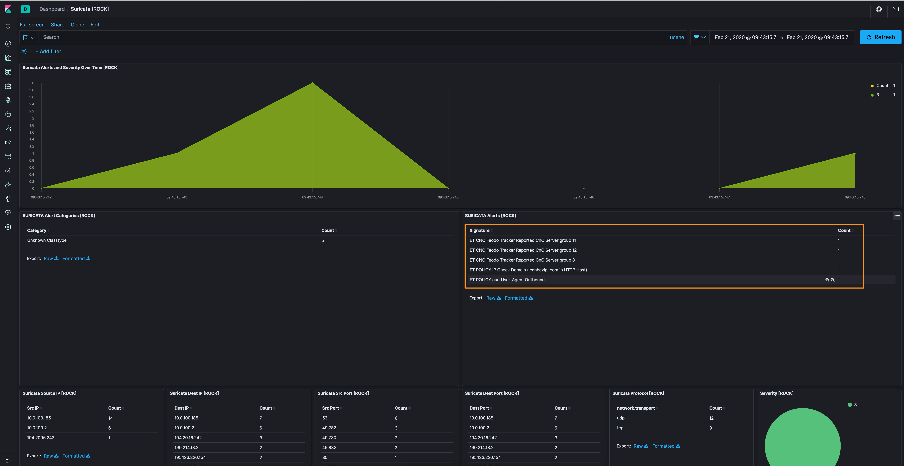
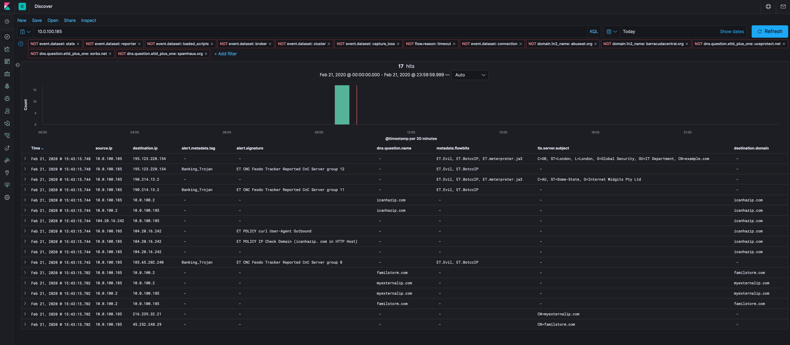

Running blog of finding evil with [RockNSM](https://rocknsm.io).  

This blog is highlight the methodologies for threat hunting ("thrunting") through network data. These are malicious PCAPs, so it's a bit like hunting for a needle in a needle stack, but these processes work for small samples to very very large ones. That said, I'm not going to "find" things that could only be identified if you knew what you were looking for. If I can find it, we'll showcase it, but if the C2 (as an example) looks like legitimate traffic, we'll list it as an artifact, but I'm not going to pretend that every packet observed is bad if I can't prove it.

Each blog post will start after using the [replaying packets](https://github.com/huntops-blue/huntops-blue.github.io/blob/master/rock-install.md#getting-data-into-rock) process with the linked packets per post.

RockNSM is an open source network security monitoring platform built with Zeek for protocol analysis, Suricata as an Intrusion Detection System (IDS), and the Elastic Stack for enrichment, storage, and visualization of network security data.  

- [ROCK installation guide](./rock-install.md)
- [Docket (the "Query PCAP" @dcode added to Kibana)](https://docs.rocknsm.io/services/docket/)
- [Replaying Packets](https://github.com/huntops-blue/huntops-blue.github.io/blob/master/rock-install.md#getting-data-into-rock)
- [Twitter @andythevariable](https://twitter.com/andythevariable)

# 2/28/2020 - Qbot (Qakbot)
- [Packets](http://malware-traffic-analysis.net/2020/01/29/index.html)
- [Ursnif banking trojan background](https://blog.talosintelligence.com/2019/05/qakbot-levels-up-with-new-obfuscation.html)

Unlike in previous posts, Qbot has not generated any Suricata rules, so we get to actually do some raw hunting!

Personally, I like to start looking at TLS traffic as it forces me to look hard at metadata instead of relying on the contents of packets. We'll move on to packets later, but let's start further down the attacker lifecycle and see if we can work our way backwards.

Of note, I've added the [ja3](https://github.com/salesforce/ja3) field to assist with this larger dataset. JA3 is a SSL/TLS client fingerprint that allows us to identify scale good (or bad) client/server TLS connections irrespective of the domain that is used. As you can see, two domains have the same `ja3` fingerprint but different destination IP addresses and domains. This will help in eliminating traffic to chase by filtering out (or on) that fingerprint instead of every domain/IP combination that could be using it.

| Source IP  | Destination IP    | tls.client.ja3 | tls.server.subject |
|-----------------|--------------|----------------------------------------------------------------|----------------|
| 10.1.29.101 | 13[.]107[.]9[.]254 | 9e10692f1b7f78228b2d4e424db3a98c | CN=*[.]msedge[.]net |
| 10.1.29.101 | 204[.]79[.]197[.]200 | 9e10692f1b7f78228b2d4e424db3a98c | CN=www[.]bing[.]com |


Let's filter out the `9e10692f1b7f78228b2d4e424db3a98c` fingerprint (and various others that are part of assumed good for now - yahoo, linkedin, skype, etc.) help get our dataset down to a manageable level (over 300 events down to 95).

Next, let's look at the largest number of TLS events, and that is `CN=gaevietovp.mobi,OU=Dobubaexo Boolkedm Bmuw,C=ES`, I've also added the `tls.validation_status` field and, as you can see, it is `unable to get local issuer certificate`. That's not necessarily bad, but it's different from the other TLS traffic samples we're looking at.


From here we have some indicators (`10.1.29.101`, `68[.]1[.]115[.]106`, and `gaevietovp[.]mobi`) that we can take and search through some traffic where we can see more than metadata, however, the only traffic for these hosts was over TLS, so we've exhausted the route and can list this as a good find based on the other information we collected above.

Next, let's remove our filters and check out the HTTP log and see if there's anything that's unencrypted that can we dig through. We'll again eliminate the assumed good (Microsoft, Windows Update, Symantec, etc.), and check out the `url.orginal` and `http.resp_mime_types`. While the filename of `4444444.png` is a bit suspect, the fact that it has a file extension of a PNG file, but it has a mime type of `application/x-dosexec` is a big red flag.


 We've got a few options to analyze this file, we can use Docket and carve it from PCAP or we can leverage the file extraction features of Zeek and just grab it right off the sensor.

 Filtering on the `files` dataset, we can see what the name of the file is that is on the sensor when we look at the `files.extracted` field - `HTTP-FQbqYF2UXkZ54fXJXi.exe`. Extracted files are located in `/data/zeek/logs/extract_files/`.

 

 ```
 ll /data/zeek/logs/extract_files/
total 464
-rw-r--r--. 1 zeek zeek 475136 Feb 25 16:38 HTTP-FQbqYF2UXkZ54fXJXi.exe
```

 If we want to carve that PCAP with Docket, we can do that too...following the TCP stream doesn't look very good /smh


So, we'll Export the HTTP Object (or look at `HTTP-FQbqYF2UXkZ54fXJXi.exe`) and hash and collect the metadata from that file (truncated).

```
...
File Name                       : 444444.png
File Type                       : Win32 EXE
File Type Extension             : exe
Time Stamp                      : 2020:01:22 15:38:11-06:00
PE Type                         : PE32
Internal Name                   : xseja
Original File Name              : xsejan.dl
Product Name                    : Xseja
...
```

There's some interesting things here that we can use when we make some Yara signatures in the Detection-Logic section below:
- it's not a PNG file, it's a Win32 PE file
- it was created on Jan 22, 2020
- the original file name was `xsejan.dl`

Furthermore, the hash of `c43367ebab80194fe69258ca9be4ac68` is loud and proud on [VirusTotal](https://www.virustotal.com/gui/file/56ee803fa903ab477f939b3894af6771aebf0138abe38ae8e3c41cf96bbb0f2a/detection) as being Qbot malware.

Okay, so we've got 3 indicators so far, what about the network systems that `444444.png` was downloaded from (`alphaenergyeng[.]com/wp-content/uploads/2020/01/ahead/444444[.]png` and `5[.]61[.]27[.]159`)? In digging into those 2, it looks like we've identified everything that talked to/from those systems.

Let's take a look at the URI structure from `alphaenergyeng[.]com/wp-content/uploads/2020/01/ahead/444444[.]png` and see if we have any more hits on systems using `wp-content/uploads/2020/01/ahead/`, disco another new hit with 2 new indicators (`103[.]91[.]92[.]1` and `bhatner[.]com/wp-content/uploads/2020/01/ahead/9312[.]zip`.


I wasn't able to `9312.zip`, I have the packets, but there are hundreds of files in the TCP stream with the same name with various sizes. I'm not sure if it's an issue with my pcap or it's an obfuscation technique. That said, searching for the URL online yielded several analysis results [1](https://app.any.run/tasks/13853cd1-4b0f-45e8-bc49-56fafc5043fe/), [2](https://any.run/report/c483c9d30f122c6675b6d61656c27d51f6a3966dc547ff4f64d38e440278030c/13853cd1-4b0f-45e8-bc49-56fafc5043fe), [3](https://unit42.paloaltonetworks.com/tutorial-qakbot-infection/).


## Detection Logic
[Additional analysis, modeling, and signatures (KQL and Yara)](https://github.com/huntops-blue/detection-logic/blob/master/qbot.md).

## Artifacts
```
68[.]1[.]115[.]106 (post infection SSL/TLS traffic)
5[.]61[.]27[.]159
103[.]91[.]92[.]1
gaevietovp[.]mobi (post infection SSL/TLS traffic)
alphaenergyeng[.]com
bhatner[.]com
c43367ebab80194fe69258ca9be4ac68 (444444.png)
275EBB5C0264DAC2D492EFD99F96C8AD (9312.zip)
7dd50e112cd23734a310b90f6f44a7cd (gaevietovp ja3 fingerprint)
```

Until next time, cheers and happy hunting!

# 2/24/2020 - Ursnif
- [Packets](http://malware-traffic-analysis.net/2020/02/11/index.html)
- [Qbot banking trojan background](https://attack.mitre.org/software/S0386/)

Suricata has picked up some easy things to get started on, so let's start there.


Of particular interest to me (not that the others aren't interesting), are the executable signatures; so let's filter out the `opendns[.]com` lookups for now. This takes us down to a single source and destination to focus on, `194[.]61[.]2[.]16` and `10.2.11.101`.


Hopping over to the Discover tab, when we apply the source IP from the previous step, we see only 8 events...definitely manageable. Let's get rid of the `alert` dataset because we know about those from the Suricata dashboard.


Now that we've used the metadata to get down to a single IP address as the potential bad actor, let's use Docket to carve the packets for that IP and see what it can tell us. Using Wireshark on these packets, we follow the TCP stream and see this URL and a downloaded PE executable.


Exporting the HTTP object gives us the PE file, which we can analyze as well.


Using `exiftool`, we can see some interesting info, mainly that the original file was called `soldier.dll` and that the File Type is `Win32 EXE` (truncated).
```
$ exiftool lastimg.png
...
File Name                       : 215z9urlgz.php%3fl=xubiz8.cab
File Type                       : Win32 EXE
File Type Extension             : exe
MIME Type                       : application/octet-stream
Image File Characteristics      : Executable, 32-bit
PE Type                         : PE32
Original File Name              : soldier.dll
...
```

Checking with VirusTotal, we see that the file hash is [known bad](https://www.virustotal.com/gui/file/996fcd8c55f923e86477d3d8069f9e9b56c6301cf9b2678c5c5c40bf6a636a5f/detection) so this looks like a good find!

Now that we have a few more hints to search through, specifically `qr12s8ygy1[.]com`, let's go back to Kibana and remove the stuff we've already found and see if we can find anything else.

*Of note, `settings-win.data.microsoft.com` appears to be a Microsoft botnet sinkhole, so while we can use some of the info, I'm going to remove this from our searches to eliminate traffic routes to chase. Additionally, I'm filtering out the OpenDNS traffic.*

Moving along, let's make a Kibana data table to clean up our view a bit and we see `95[.]169[.]181[.]35` and `lcdixieeoe[.]com`, of note are those long URI's + an AVI file. Let's use Docket to see what's in those packets.


Hopping right into Exporting the HTTP objects, we see the `*.avi` files we observed in Kibana's `url.original` field. Let's save those and take a look.


In looking at the metadata for those "avi" files, we see that they're actually just Text files.

```
======== B.avi
...
File Name                       : B.avi
File Type                       : TXT
File Type Extension             : txt
MIME Type                       : text/plain
...
======== alSLK.avi
...
File Name                       : alSLK.avi
File Type                       : TXT
File Type Extension             : txt
MIME Type                       : text/plain
...
======== jNjcj.avi
...
File Name                       : jNjcj.avi
File Type                       : TXT
File Type Extension             : txt
MIME Type                       : text/plain
...
```

I poked and prodded on these files, but I'm not sure what they are...but I know they aren't normal media files. It looks like Base64 encoding, but I'm not sure what order they're supposed to be assembled in to decode. Either way, they have the `.avi` file extension and certainly aren't, so I'd put that in the suspect category.

Extract of `B.avi`
```
...
p1kTy18hM3gcANzilINMVJWdUP4AbxDka8IVGBACN+HkZxzdIOi86DoUwglmVgw+BsGdGC3WLgE45BoaeDFcYxpoS8/HzXcwtxxa45Wiqordymiv5JlqzxHWS647gV2B0XpV1+A5h9PTPvxdfJV/CIAYGgCqFLzlxXF3znojgEGWHj/MwRbhIgMIKm9FDqEQEqxjDIv0SC+sqN9TxpQLNPCdqJwMTuQN2sfat464J1bh9LWzHwPwyZXErBH5+XmvEbIjOX3ptyRJOa4C+W0Cf6yOFLIPWas659a0x5tZAQs1VbwMjylWLlx6LA2Dmop1C4dwb+zH5SSJrYo5RKbc6DV1AmmRpeJ1NXkO30Z2Bq27U+h3uRUnMulPWSp1uTeLwc8LSFK49kTIaV0lwWNfDeb975aPmPac6kZP/5g5xgfB5/53/kC2KvHCbMUF8RotemD2ak+Lc0gzP7W/pcmbw/ZhxmdFJd5rPJz1lhGIOEZX6buFkcg3vjsBInd319vLO+ZSZmbU8m1ZryNsfLZ56tEvbafgCY1Jz/tP4UdKL6DZPyjCXC7oIEoCO3yn/yHOaFFQvOFizv2OnUPVW3ST+BN/TwkHUSZfE1+lKvjXJBsONeaiAa5ozLa2uI/ebx1caPFMjw0j62H23r0YFd0opsTw2ovlkvKcx3eoT
...
```

Extract of a normal .avi files
```
RIFF,O
AVI LIST�hdrlavih85�
                    �"�LISTtstrlstrh8vidscvid�"�strf((�IV41JUNKLIST�;
movi00db~
���|
��`��؝����@�|��@�P!����9���&��y��i��y���y��y>�����<��<��y���<��<��<��<��<��<��<��<��<��<��<��<��<��<��<��<��<��<ϲ<����<��<��<ϳ��<��<��<��(��<��<��,��<�S<��<��<��|��y��y>���<��<��<����|n��y��y���y>3��y��y��y�Qm<�� �Z�;d�����ߢS%����T��!~nV�&~RVG���(p&
                                                                    ��۹+��$g�E���V���
�q��b�Z0���I.B�k����X�+|dy:$�X1��9��'ҙ*�
9�1d!��P�x����l�y"d�m'a��#Ԏ&Z]�"�%����fzڬ��q"j�g�c�X�(�p��j��xs`�<Ĺg�R�$��pY�1�
(
 p6��� E	s	V�pɫ�Œ�vNaG�(q�9�����"*���%
                                                    
                                                     �k�8mY��f�."s�8
                                                                    �(WL�!<-|=_���C&�ďo�s8��nj��T	sh��YX�oB�B��(NᠱI��ib��8���Y\�'1A�.�B$t´pHfB<�9���A�n5Hf�R�D��
                                                                                                                                                                      �g��9sVI���CsF!����2����S�Q�E�P��5Xj�txMF:�G�q�S��k�0N(3q]-��O�J��$��ID>��a�
����c'                                                      A9��
P@X
```

Trying a bit more on these files, 2 of these "avi" files end in `=` (`B.avi` and `jNjcj.avi`), so I am definitely leaning more towards Base64. The file that doesn't end in a `=` (`alSLK.avi`), I tried to append that to the top of the two files that do end in `=` and then run `base64 -D -i [file] -o [file]`, it created binary files (which seems like progress), but no luck in taking it apart. If anyone has any ideas here, feel free to reach out.

Malware Traffic Analysis noted another indicator that was identified through the analysis of the infected Word documents (`45[.]141[.]103[.]204` and `q68jaydon3t[.]com`), which we don't have. So while we see the traffic, it is all over TLS minus the initial DNS request so there's not much we can do for that. The `ja3` nor `ja3s` hash was collected. I'm adding it to the artifacts below, but this would only be "known bad" if it was found through analysis of the document.

## Detection Logic
[Additional analysis, modeling, and signatures (KQL and Yara)](https://github.com/huntops-blue/detection-logic/blob/master/ursnif.md).

## Artifacts
```
194[.]61[.]2[.]16
95[.]169[.]181[.]35
45[.]141[.]103[.]204 (found by Malware Traffic Analysis)
8962cd86b47148840b6067c971ada128
7e34d6e790707bcc862fd54c0129abfa
40186e831cd2e9679ca725064d2ab0fb
2b93fcafabab58a109fcbca4377cccda
qr12s8ygy1[.]com
lcdixieeoe[.]com
q68jaydon3t[.]com (found by Malware Traffic Analysis)
xubiz8[.]cab
/khogpfyc8n/215z9urlgz[.]php
```

Until next time, cheers and happy hunting!

# 2/21/2020 - Trickbot gtag wecan23 Infection
- [Packets](https://www.malware-traffic-analysis.net/2020/02/19/index.html)
- [Trickbot information stealer background](https://unit42.paloaltonetworks.com/trickbot-campaign-uses-fake-payroll-emails-to-conduct-phishing-attacks/)
- [gtag information stealer background](https://www.fireeye.com/blog/threat-research/2019/01/a-nasty-trick-from-credential-theft-malware-to-business-disruption.html)

Right out of the gate, the Suricata dashboard is telling us something is amiss.  



Let's pop over to the Discover tab and see what we can ferret out. We'll apply the `alert.signature exists` filter and add `destination.ip`, `source.ip`, `alert.signature`, and `alert.metadata.tag` and, pretty maids, all in a row.

| Destination IP  | Source IP    | Signature                                                      | Tag            |
|-----------------|--------------|----------------------------------------------------------------|----------------|
| 195[.]123[.]220[.]154 | 10.0.100.185 | ET CNC Feodo Tracker Reported CnC Server group 12        | Banking_Trojan |
| 185[.]65[.]202[.]240  | 10.0.100.185 | ET CNC Feodo Tracker Reported CnC Server group 8         | Banking_Trojan |
| 190[.]214[.]13[.]2    | 10.0.100.185 | ET CNC Feodo Tracker Reported CnC Server group 11        | Banking_Trojan |
| 104[.]20[.]16[.]242   | 10.0.100.185 | ET POLICY curl User-Agent Outbound                       | -              |
| 104[.]20[.]16[.]242   | 10.0.100.185 | ET POLICY IP Check Domain (icanhazip[.]com in HTTP Host) | -              |

Boom, we found the Trickbot TLS connections, but what about `wecan23`?

*Note: As I dug through this, I found a lot of DNS traffic to blocklists (`cbl.abuseat[.]org`, `barracudacentral[.]org`, `uceprotect[.]net`, etc.). While the victim (or the pcap sampler) seemingly use these lists, I excluded this as it's not part of the infection.*

As we see in the the table above, `10.0.100.185` seems to be infected. So let's filter in on that IP address in Kibana.



Let's get rid of our known bad Destination IPs (above), the IP recon domains (`icanhazip` and `externalip.com`), and see what is left over to see if there's anything else we can find. I'm also going to drop the DNS server out (`10.0.100.2`), while there's good info there, we've got others to look at that might have more. If there's nothing, we can do a DNS hunt.


Of interest, the connection between `10.0.100.185` and `192[.]3[.]124[.]40` is over port `80`, but there's not a corresponding HTTP Zeek log, so we'll have to use Docket to carve the PCAP and check it out in Wireshark.


As we can see, the file name is `lastimg.png`, but the file type metadata has a magic number of `MZ`, which is a PE binary. Using `Export HTTP Objects` in Wireshark, we can see there are 2 "png" files called `lastimg.png` as well as `mini.png`. We'll carve those out and statically analyze them.

Using `exiftool`, we can see some interesting info, mainly that the original file was called `002.exe` and that the File Type is `Win32 EXE`, not an image (truncated).
```
$ exiftool lastimg.png
...
File Name                       : lastimg.png
File Type                       : Win32 EXE
File Type Extension             : exe
MIME Type                       : application/octet-stream
Image File Characteristics      : Executable, 32-bit
PE Type                         : PE32
Original File Name              : 002.exe
Product Name                    : 002.exe
...
```

Let's see what VirusTotal knows about these 2 files by searching their MD5 hashes [1](https://www.virustotal.com/gui/search/489eef73a1a5880f644f3b60267db7e8)[2](https://www.virustotal.com/gui/search/c1820b0685ea2c16a9da3efd2f3b58d9)...**EVIL!**.

Back to Kibana and see what else is there. As before, let's get rid of our known bad and all we have left is `203[.]176[.]135[.]102`.


Like before, it's only Connection log stuff, so let's carve the PCAP between `10.0.100.185` and `203[.]176[.]135[.]102` and see what we find in Wireshark, which appears to be posting host IDs, running processes, usernames, workstation domain, etc. to a server `Cowboy`.


There was a lot of this kind of data being uploaded; feel free to explore it on your own and...obfuscating all of this data is exhausting.

## Artifacts
```
203[.]176[.]135[.]102
195[.]123[.]220[.]154
185[.]65[.]202[.]240
190[.]214[.]13[.]2
192[.]3[.]124[.]40
/wecan23/
489eef73a1a5880f644f3b60267db7e
c1820b0685ea2c16a9da3efd2f3b58d9
```

Until next time, cheers and happy hunting!

---
*Packets provided by [Malware Traffic Analysis](https://www.malware-traffic-analysis.net) - @malware_traffic*
